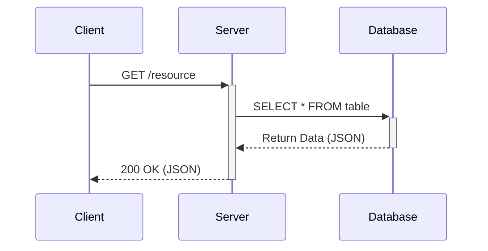

# Rest API Interaction Flow


## 1. Create User

### Request

- Method: `POST`
- Endpoint: `/api/users/create`
- Headers:
    - `Content-Type: application/json`
    - `Accept: application/json`
- Body:
  ```json
  {
    "name": "Foo Bar"
  }
  ```

### Response

```http
HTTP/1.1 201 Created
Content-Type: application/json

{
  "message": "User created successfully"
}

```
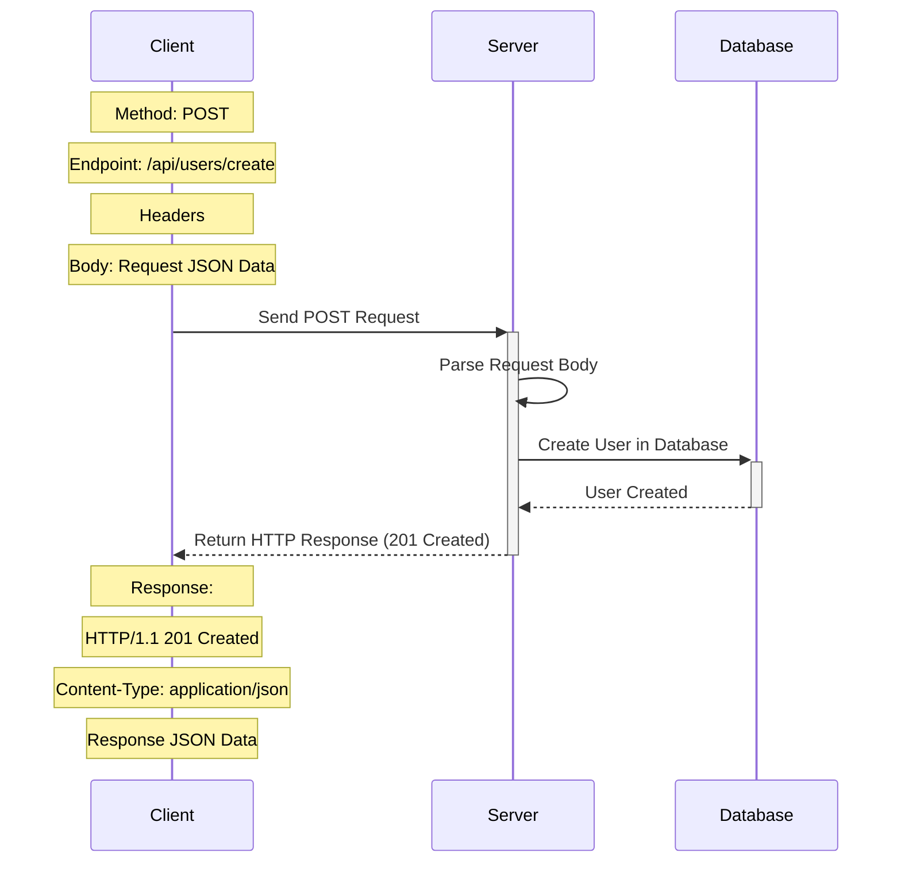

---

## 2. Get Sleep Improvements

### Request:

- Method: `GET`
- Endpoint: `/api/sleep/improvements`
- Headers:
    - `Accept: application/json`

### Response:

```http
HTTP/1.1 200 OK
Content-Type: application/json
```

```json
{
  "improvements": [
    {
      "id": "1",
      "description": "I would go to sleep easily"
    },
    {
      "id": "2",
      "description": "I would sleep through the night"
    },
    {
      "id": "3",
      "description": "I'd wake up on time, refreshed"
    }
  ]
}
```
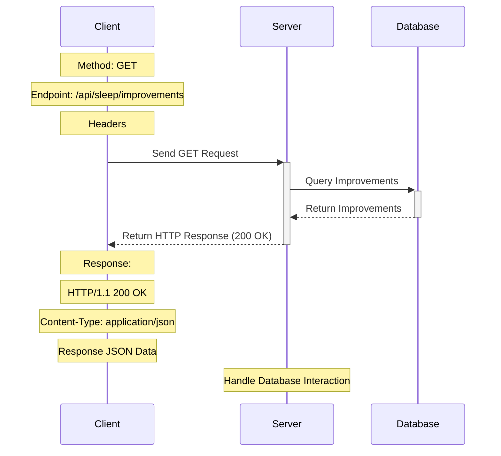
---

## 3. Post Sleep Improvement

### Request:

- Method: `POST`
- Endpoint: `/api/users/{userID}/improvement`
- Parameters:
    - `{userID}`: The ID of the user for whom the improvement is being added
- Headers:
    - `Accept: application/json`
    - `Content-Type: application/json`
- Body:

```json
{
  "improvements": [
    {
      "userID": "31",
      "improvementID": 1
      "improvement": "I would go to sleep easily"
    }
  ]
}
```

### Response:

```http
HTTP/1.1 201 Created
Content-Type: application/json
```

```json
{
  "message": "Improvement added successfully"
}
```
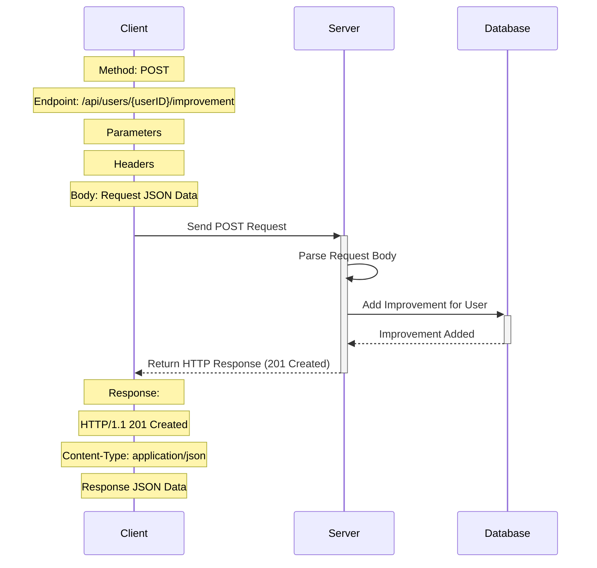
## 4. Get Sleep Struggle Durations

### Request:

- Method: `GET`
- Endpoint: `/api/sleep/struggle-durations`
- Headers:
    - `Accept: application/json`

### Response:

```http
HTTP/1.1 200 OK
Content-Type: application/json
```

```json
{
  "durations": [
    {
      "id": "1",
      "duration": "Less than 2 weeks"
    },
    {
      "id": "2",
      "duration": "2 to 8 weeks"
    },
    {
      "id": "3",
      "duration": "More than 8 weeks"
    }
  ]
}
```
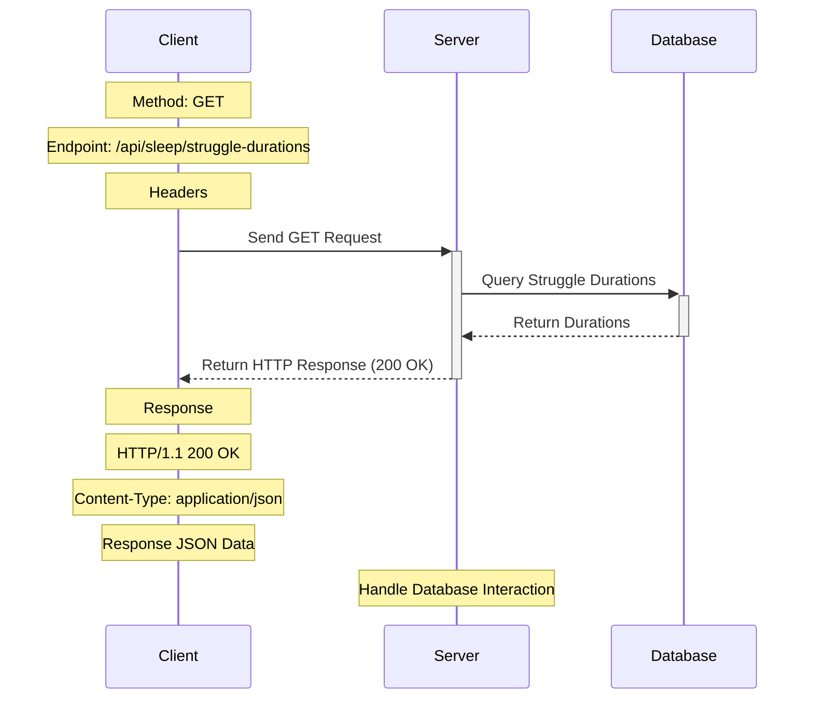

---

## 5. Post Sleep Struggle Suration

### Request:

- Method: `POST`
- Endpoint: `/api/users/{userID}/struggle/duration`
- Parameters:
    - `{userID}`: The ID of the user for whom the struggle duration is being added
- Headers:
    - `Accept: application/json`
    - `Content-Type: application/json`
- Body:

```json

{
    "userID": "31",
    "durationID": 1
    "duration": "More than 8 weeks"
}

```

### Response:

```http
HTTP/1.1 201 Created
Content-Type: application/json
```

```json
{
  "message": "Struggling duration added successfully"
}
```
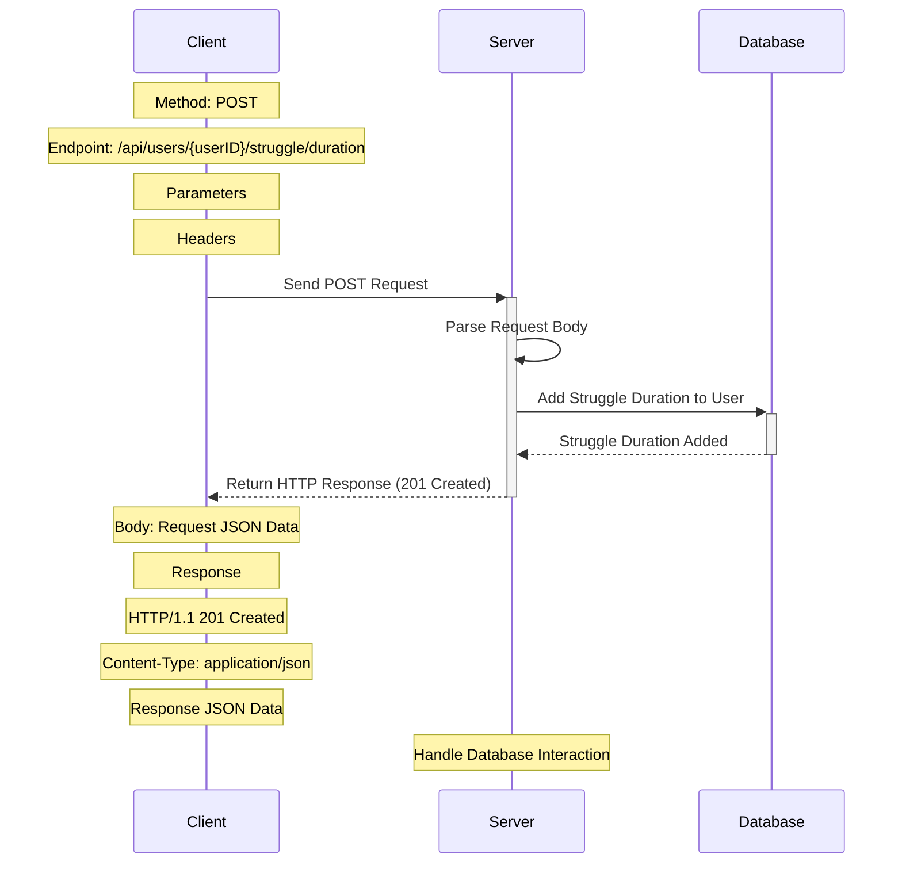

---
## 6. Set Sleep Time
### Request:

- Method: `POST`
- Endpoint: `/api/users/{userID}/sleep/time`
- Parameters:
    - `{userID}`: The ID of the user for whom the sleep time is being added
- Headers:
    - `Accept: application/json`
    - `Content-Type: application/json`
- Body:

```json
{
  "time": "3:00"
}
```

### Response:

```http
HTTP/1.1 200 OK
Content-Type: application/json

{
  "message": "Sleep time added successfully"
}
```

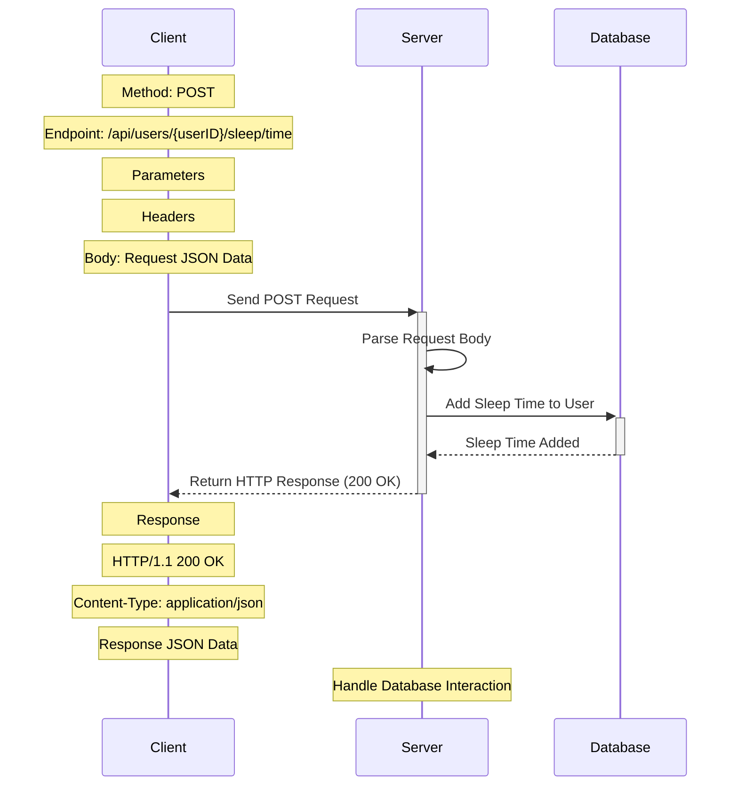
---
## 7. Set Wake Up Time
### Request:

- Method: `POST`
- Endpoint: `/api/users/{userID}/wakeup/time`
- Parameters:
    - `{userID}`: The ID of the user for whom the wakeup time is being added
- Headers:
    - `Accept: application/json`
    - `Content-Type: application/json`
- Body:

```json
{
  "time": "10:00"
}
```

### Response:

```http
HTTP/1.1 200 OK
Content-Type: application/json

{
  "message": "wakeup time added successfully"
}
```
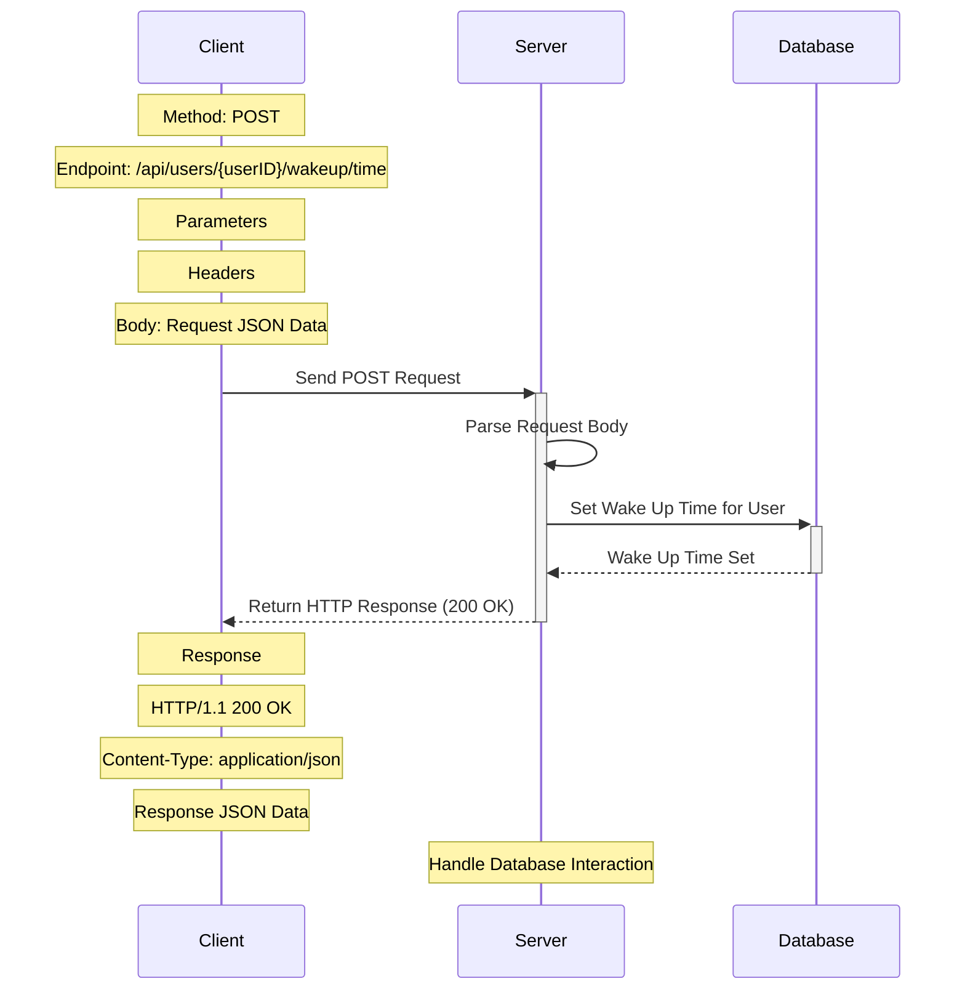

## 8. Post Sleep Hours
### Request:

- Method: `POST`
- Endpoint: `/api/users/{userID}/sleep/hours`
- Parameters:
    - `{userID}`: The ID of the user for whom the sleep hours is being added
- Headers:
    - `Accept: application/json`
    - `Content-Type: application/json`
- Body:

```json
{
  "hours": 6
}
```

### Response:

```http
HTTP/1.1 200 OK
Content-Type: application/json

{
  "message": "sleep hours added successfully"
}
```
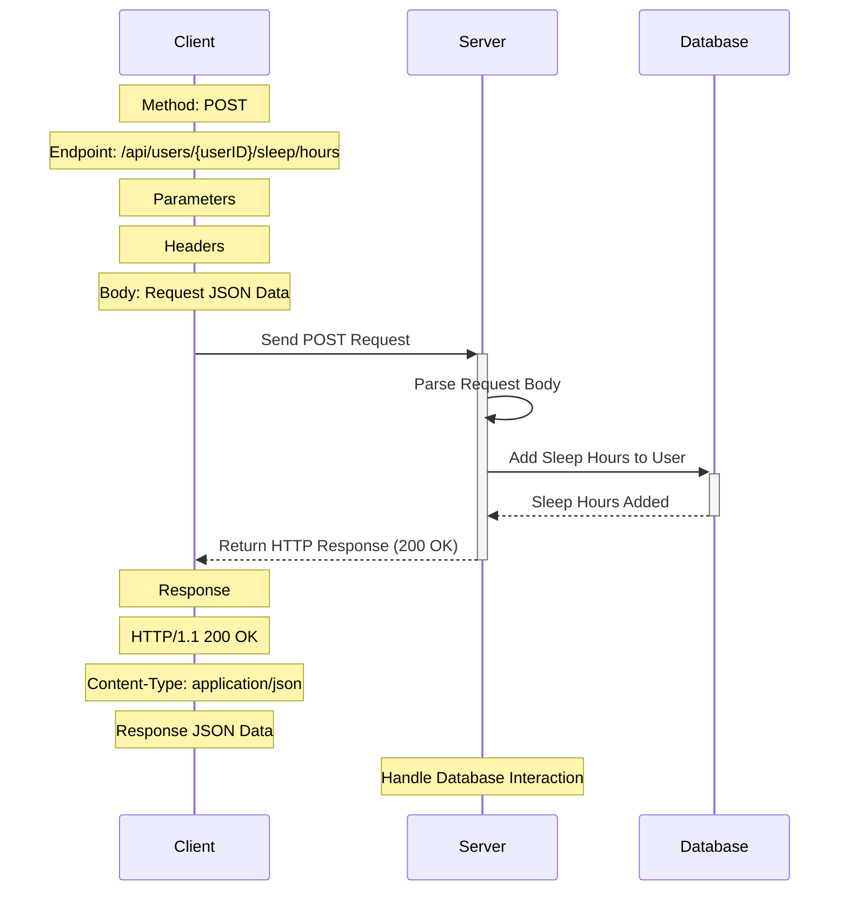
## 9. Get Sleep Efficiency
### Request:

- Method: `GET`
- Endpoint: `/api/users/{userID}/sleep/efficiency`
- Parameters:
    - `{userID}
- Headers:
    - `Accept: application/json`

### Response:

```http
HTTP/1.1 200 OK
Content-Type: application/json

{
  "sleepEfficiency": 85
}
```

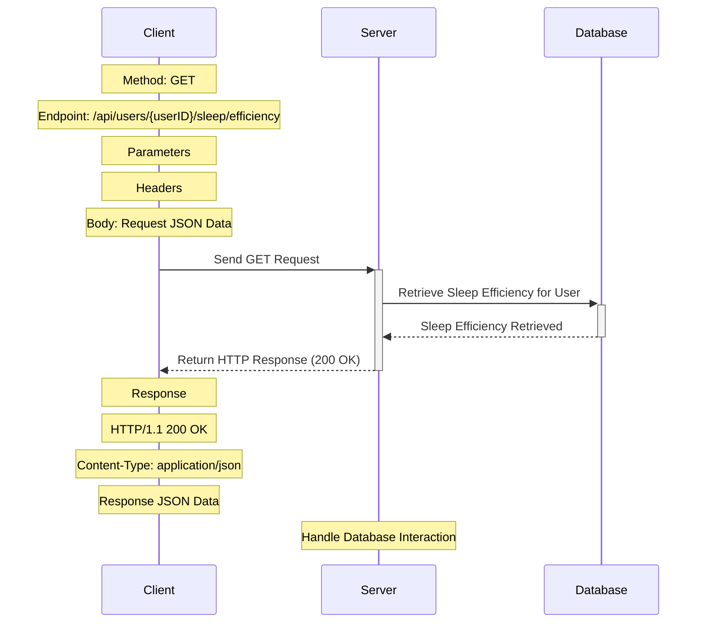

## Data Modeling

### User Table

| Column                  | Type           | Description                                |
|-------------------------|----------------|--------------------------------------------|
| id                      | integer        | User ID (Primary Key)                      |
| name (required)         | varchar(255)   | User's name (Required)                     |
| efficiency              | integer        | Sleep efficiency                           |
| sleep_hours             | integer        | Number of hours slept                       |
| sleep_time              | time           | Time when user goes to bed                  |
| wakeup_time             | time           | Time when user wakes up                     |
| sleep_improvement  | varchar(255)   | Description of sleep improvement

---

### Sleep Table

| Column                  | Type           | Description                                |
|-------------------------|----------------|--------------------------------------------|
| id                      | integer        | Sleep ID (Primary Key)                     |

---
### Struggle durations Table

| Column                  | Type           | Description                                |
|-------------------------|----------------|--------------------------------------------|
| id                      | integer        | Struggle ID (Primary Key)                  |
| sleep_id (FK)           | integer        | Sleep ID (Foreign Key)                     |
| duration (required)     | varchar(255)   | Duration of sleep struggle (Required)      |

---
### Improvement Table

| Column                  | Type           | Description                                |
|-------------------------|----------------|--------------------------------------------|
| id                      | integer        | Improvement ID (Primary Key)               |
| sleep_id (FK)           | integer        | Sleep ID (Foreign Key)                     |
| user_id (FK)            | integer        | User ID (Foreign Key)                      |
| improvement (required)  | varchar(255)   | Description of sleep improvement (Required)|


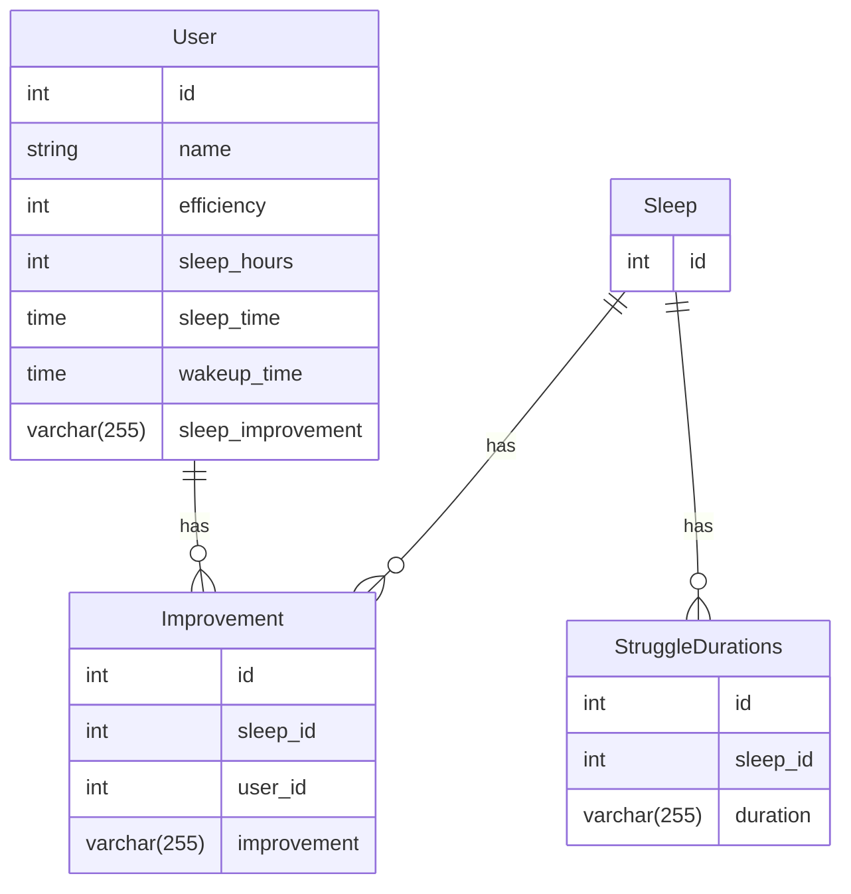
